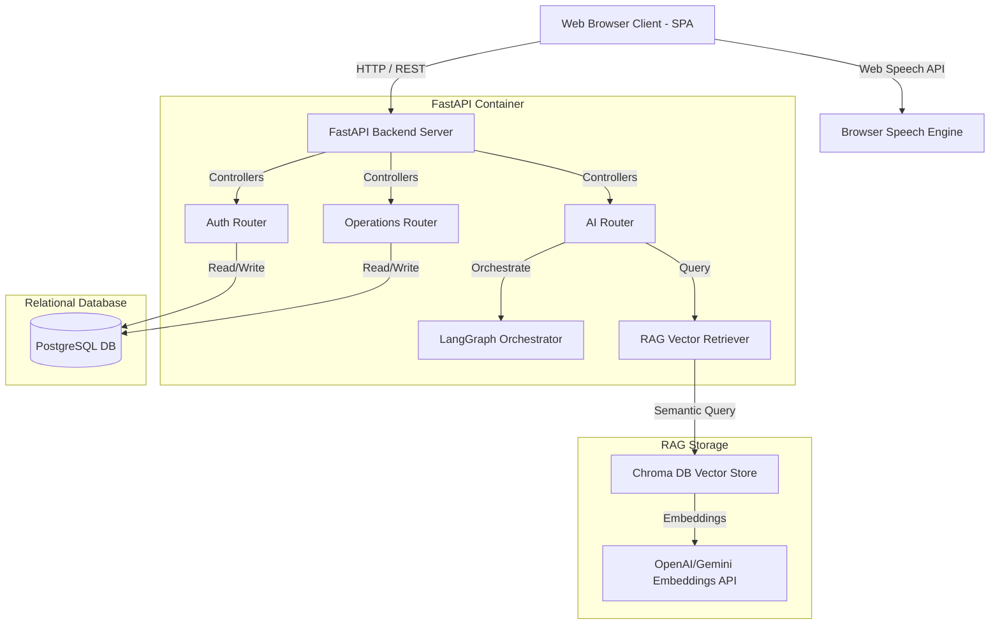
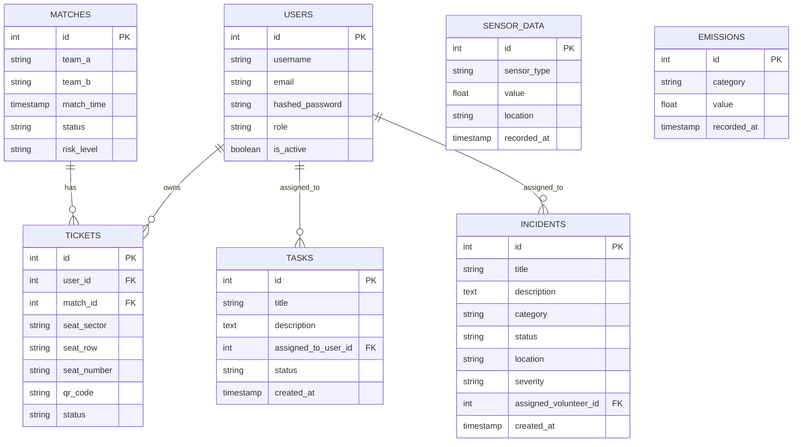

# FIFA World Cup AI Command Center - Architecture Guide

This guide details the technical blueprint of the FIFA World Cup AI Command Center platform, covering database schemas, RAG vector lookup designs, LangGraph multi-agent coordination flows, security guidelines, and deployment topology.

---

## 🏛️ System Topology

The command center is deployed as a secure, containerized architecture that decouples frontend user interactions, API services, and vector database engines:

---

## 🗄️ Database Entity-Relationship (ER) Diagram

The system stores persistent transactional operational states, identity mappings, and IoT metrics inside PostgreSQL:

---

## 🤖 Multi-Agent LangGraph Flow Diagram

The multi-agent coordinator uses a LangGraph `StateGraph` to routing commands dynamically. The master `OperationsCoordinator` node processes user inputs and conditionally delegates them to specialized agent nodes:

```mermaid
sequenceDiagram
    autonumber
    actor Operator as Operator / User
    participant Ops as Operations Coordinator (Master Node)
    participant Nav as Navigation Agent
    participant Crowd as Crowd Agent
    participant Emg as Emergency Agent
    participant Vol as Volunteer Copilot
    participant DB as Chroma DB (Vector Store)

    Operator->>Ops: "Alert! Incident #1024 - Smoke alarm in VIP box corridor"
    Note over Ops: Evaluates threat intent: Critical Risk
    Ops-->>Emg: Route to Emergency Agent
    
    rect rgb(30, 20, 20)
        Note over Emg: Trigger Evacuation State
        Emg->>DB: Query "Emergency egress corridors Sector B"
        DB-->>Emg: Returns safe exit routes
        Emg->>Operator: Evacuate Sectors 108-116. Divert flow to Gate A.
    end

    Ops-->>Vol: Route dispatch details to Volunteer Agent
    Vol->>Operator: Dispatched Volunteer Team 2 to aid evacuation exit.
```

---

## 🛡️ Enterprise Security Model

To ensure a production-ready profile, the following security constraints are enforced at the API and database levels:

1. **Role-Based Access Control (RBAC):**
   - **Operator (Admin):** Full write permissions for incident dispatching, emergency simulation triggers, report rendering, and system configs.
   - **Volunteer:** Read-only access to matches and public maps. Write permissions restricted to task state updates (e.g. marking a task complete) and translating local audio announcements.
   - **Fan:** Restricted access to their ticket barcode QR and concessions recommendations. Able to prompt the AI Assistant for rules queries.

2. **Data & Credential Protection:**
   - **Hash Encryption:** All user credentials must be stored using strong bcrypt hashing (prefixed via security wrappers) to mitigate SQL injection risk.
   - **Secure Token Transmission:** Standard JSON Web Token (JWT) verification limits access tokens to a 24-hour expiry interval.

3. **CORS and Boundary Rules:**
   - Cross-Origin Resource Sharing is locked down to official subdomains in production.
   - Database operations execute using transaction context blocks (`get_db` generator session) to prevent memory leaks and dangling pool connections.
